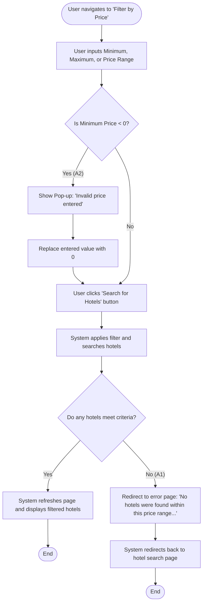

# Feature: [Filter of price]
## Use Case: [Фільтрація готелів за ціною]

Основним учасником є користувач, який повинен обрати фільтрацію ціни готелю (обрати мінімальну ціну АБО максимальну ціну АБО мінімальну та максимальну ціну), після цього система перевіряє чи мінімальна ціна не менше нуля, якщо мінімальна ціна менше 0 тоді показує помилку та повертає мінімальну ціну як 0, якщо мінімальна ціна більше нуля продовжується процес. Юзер клікає на пошук готелей за обраною ціною, система відділяє готелі та показує їх на сторінці; якщо жодний готель не підпадає під критерії користувача система перенаправлює нас на сторінку з помилкою де вказано що готелей не знайдено, після цього перенаправлює на пошук готелей; якщо віднайшовся хоча б один готель за критеріями юзера, система показує це

